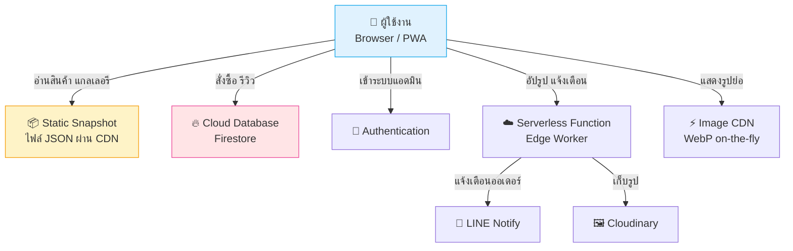

<div align="center">

# Diamond Cute Studio 💎💎

### ระบบร้านพิมพ์ภาพออนไลน์ครบวงจร — สั่งซื้อ ออกแบบ ชำระเงิน ติดตามงาน ในที่เดียว

*A full-featured online photo-printing storefront — browse, customize, checkout, and track orders.*

[](https://chaiwutz14.github.io/Diamond-Cute-Studio/)
[]()
[]()
[]()

</div>

---

## 📖 เกี่ยวกับโปรเจกต์ (Overview)

**Diamond Cute Studio** เป็นเว็บแอปพลิเคชันสำหรับร้านพิมพ์ภาพ ที่ออกแบบมาให้ลูกค้าสั่งซื้อสินค้า อัปโหลดรูปที่ต้องการพิมพ์ ชำระเงินผ่าน PromptPay และติดตามสถานะงานได้เองทั้งหมด พร้อมระบบหลังบ้านสำหรับเจ้าของร้านในการจัดการสินค้า ออเดอร์ และเนื้อหาเว็บไซต์

โปรเจกต์นี้สร้างขึ้นด้วยแนวคิด **"เว็บไซต์เร็ว เสถียร และดูแลง่าย"** บนสถาปัตยกรรมแบบ Static-first ที่รองรับผู้ใช้จำนวนมากได้โดยใช้ทรัพยากรน้อย

> 🌐 **ลองใช้งานจริง:** [chaiwutz14.github.io/Diamond-Cute-Studio](https://chaiwutz14.github.io/Diamond-Cute-Studio/)

---

## ✨ ฟีเจอร์เด่น (Features)

### 🛍️ ฝั่งลูกค้า (Customer)
- **แคตตาล็อกสินค้า** — เรียกดูสินค้าพิมพ์ภาพแยกตามหมวดหมู่ พร้อมรูปตัวอย่าง
- **ออกแบบเอง** — อัปโหลดรูปและดูตัวอย่างงานก่อนสั่ง (live preview)
- **ตะกร้าสินค้า + เช็คเอาต์หลายขั้นตอน** — ขั้นตอนชัดเจน ใช้งานง่าย
- **ชำระเงิน PromptPay** — สร้าง QR อัตโนมัติ + แนบสลิป + ตรวจสลิปเบื้องต้น
- **คูปองส่วนลด** — รองรับโค้ดส่วนลดหลายรูปแบบ
- **ติดตามออเดอร์** — เช็คสถานะงานด้วยเบอร์โทรศัพท์
- **รีวิวสินค้า** — ลูกค้ารีวิวได้ (ผ่านการอนุมัติก่อนแสดง)
- **6 ธีมสีให้เลือก** — ปรับโทนเว็บได้ตามชอบ (sky, sakura, mint, peach, lavender, midnight)
- **ติดตั้งเป็นแอปได้ (PWA)** — ใช้งานแบบ Native App บนมือถือ + รองรับออฟไลน์บางส่วน

### ⚙️ ฝั่งผู้ดูแลร้าน (Admin)
- จัดการสินค้า แกลเลอรีผลงาน และหมวดหมู่
- จัดการออเดอร์และสถานะการจัดส่ง
- ระบบคูปองส่วนลด
- ตรวจและอนุมัติรีวิว
- แก้ไขเนื้อหาหน้าเว็บได้เอง (in-app CMS)
- แดชบอร์ดสรุปภาพรวมร้าน
- แจ้งเตือนออเดอร์ใหม่ผ่าน LINE

---

## 🏗️ สถาปัตยกรรม (Architecture)

โปรเจกต์ใช้สถาปัตยกรรมแบบ **Static-first + Serverless** เพื่อความเร็วและความประหยัด



### หลักการออกแบบสำคัญ
- **Snapshot-first loading** — หน้าเว็บอ่านข้อมูลสินค้า/แกลเลอรีจากไฟล์ JSON บน CDN ก่อน ทำให้โหลดเร็วและรองรับผู้เข้าชมจำนวนมากได้โดยแทบไม่แตะฐานข้อมูล
- **Progressive fallback** — ทุกชั้นมีระบบสำรอง หากส่วนใดส่วนหนึ่งไม่พร้อม ระบบยังทำงานต่อได้
- **Lazy loading** — โหลดทรัพยากรหนักเฉพาะเมื่อจำเป็น
- **Design token system** — ระบบสีและสไตล์รวมศูนย์ รองรับหลายธีมด้วยโค้ดชุดเดียว

---

## 🛠️ เทคโนโลยีที่ใช้ (Tech Stack)

| ส่วน | เทคโนโลยี |
|------|-----------|
| **Frontend** | Vanilla JavaScript (ไม่ใช้เฟรมเวิร์ก), HTML5, CSS3 |
| **Hosting** | GitHub Pages (Static Site) |
| **Database** | Google Firebase — Firestore |
| **Authentication** | Firebase Authentication |
| **Serverless** | Cloudflare Workers (Edge Functions) |
| **Image Pipeline** | Cloudinary (อัปผ่าน Cloudflare Worker) + WebP CDN |
| **PWA** | Service Worker + Web App Manifest |
| **Security** | Firebase App Check (reCAPTCHA) + Cloudflare Turnstile (กันบอต) |
| **Notifications** | LINE Messaging API |

> 💡 เลือกใช้ **Vanilla JavaScript** โดยตั้งใจ เพื่อให้เว็บเบา โหลดเร็ว และไม่มี dependency ที่ต้องดูแลมาก

---

## 📁 โครงสร้างโปรเจกต์ (Project Structure)

```
Diamond-Cute-Studio/
├── index.html              # หน้าแรก
├── catalog.html            # แคตตาล็อกสินค้า
├── product.html            # รายละเอียดสินค้า + ออกแบบ
├── cart.html               # ตะกร้า + เช็คเอาต์
├── gallery.html            # แกลเลอรีผลงาน
├── orders.html             # ติดตามออเดอร์
├── about.html / contact.html
│
├── css/                    # สไตล์ + ระบบธีม (design tokens)
│   ├── core.css            #   สไตล์หลัก (รวมไฟล์เพื่อลด requests)
│   ├── themes.css          #   ระบบ 6 ธีมสี
│   └── ...
│
├── js/                     # ตรรกะฝั่ง client (modular)
│   ├── utils.js            #   ฟังก์ชันหลัก + data layer
│   ├── home.js             #   หน้าแรก
│   ├── product.js          #   หน้าสินค้า + ตัวออกแบบ
│   ├── order.js            #   ระบบเช็คเอาต์
│   └── ...
│
├── data/                   # Static snapshot (JSON)
│   ├── products.json       #   ข้อมูลสินค้า (เสิร์ฟผ่าน CDN)
│   └── gallery.json        #   ข้อมูลแกลเลอรี
│
├── assets/                 # ไอคอน + รูปประกอบ
├── sw.js                   # Service Worker (PWA + offline)
├── manifest.webmanifest    # PWA manifest
└── sitemap.xml / robots.txt
```

---

## ⚡ ประสิทธิภาพ (Performance Highlights)

- 🚀 **อ่านข้อมูลแทบเป็น 0 query** — ใช้ static snapshot บน CDN แทนการ query ฐานข้อมูลทุกครั้ง
- 🖼️ **รูปภาพ WebP อัตโนมัติ** — ย่อขนาดตามการแสดงผลจริงผ่าน image CDN
- 📦 **Bundle เบา** — ไม่มีเฟรมเวิร์ก โหลด JavaScript น้อย
- 💤 **Lazy loading** — รูปและสคริปต์หนักโหลดเมื่อจำเป็น
- 📱 **Mobile-first + PWA** — ออกแบบเพื่อมือถือก่อน ติดตั้งเป็นแอปได้

---

## 🎨 ดีไซน์ (Design)

- ระบบ **6 ธีมสี** สลับได้ทันที ผ่าน CSS Custom Properties
- ออกแบบตามแนวทาง **WCAG AA** เรื่องความคมชัดของสี
- UI โทนพาสเทลน่ารัก เหมาะกับแบรนด์ร้านพิมพ์ภาพ
- Skeleton loading + Toast notifications เพื่อประสบการณ์ที่ลื่นไหล

---

## 🚀 การพัฒนา (Local Development)

เนื่องจากเป็น static site สามารถรันในเครื่องได้ด้วย local server ใดก็ได้:

```bash
# ตัวอย่างด้วย Python
python3 -m http.server 8080

# หรือด้วย Node (serve)
npx serve .
```

แล้วเปิด `http://localhost:8080`

> ⚙️ การตั้งค่าเชื่อมต่อบริการภายนอก (ฐานข้อมูล / serverless / การแจ้งเตือน) จัดเก็บแยกต่างหากและไม่รวมอยู่ในที่นี้

---

## 📌 สถานะโปรเจกต์ (Status)

🟢 **Production** — ใช้งานจริงแล้ว และอยู่ระหว่างการพัฒนาต่อเนื่อง

โปรเจกต์นี้พัฒนาด้วยแนวทาง iterative มีการปรับปรุงด้านความปลอดภัย ประสิทธิภาพ และประสบการณ์ผู้ใช้อย่างต่อเนื่อง

---

## 📝 License

โปรเจกต์นี้เป็น **Proprietary** — สงวนลิขสิทธิ์ ไม่อนุญาตให้นำไปใช้ในเชิงพาณิชย์โดยไม่ได้รับอนุญาต

ภาพประกอบ ไอคอน และกราฟิกทั้งหมดเป็นงานออกแบบเฉพาะของ Diamond Cute Studio

---

<div align="center">

**Diamond Cute Studio 💎**

*Built with care for a small business that prints memories.*

</div>
